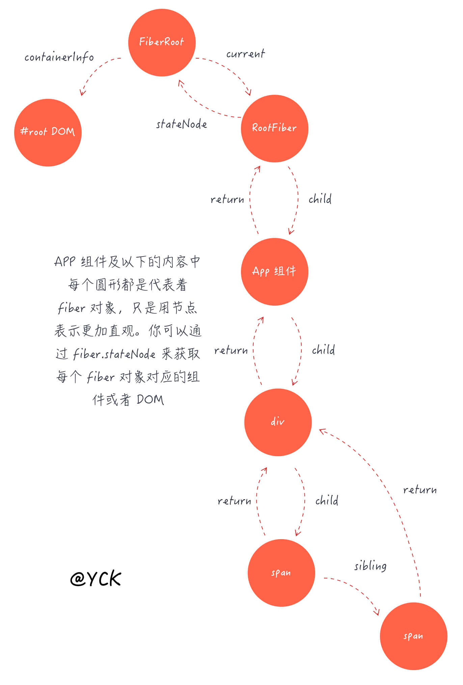

jsx -> js

- function 和类数组的区别（tag 是否是变量，或者是字符串）大小写的约定
- 通过`chrildren`来表示并列和嵌套关系
  React.createElement(tag,options,...chrilren);

React.createRef

ref 三种实现方式(在类组件中)

```jsx
class Demo extends React.Component {
  constructor(props) {
    super(props);
    this.createFuncRef = React.createRef(); // create {current:null}
  }
  render() {
    return (
      <div>
        <span ref="stringRef">demo1</span>
        <span
          ref={ref => {
            this.functionRef = ref;
          }}
        >
          demo2
        </span>
        <span ref={this.createFuncRef}>demo1</span>
      </div>
    );
  }
}
```

ref 在函数组件中使用 React.forwardRef()

memo 相当于 pureComponent

```js
ReactDOM.render(<App />, document.getElementById("root"));
```

ReactDOM.render
==> legacyRenderSubtreeIntoContainer(null,element,container,false,callback) {

    1. 给root赋值 legacyCreateRootFromDOMContainer(container<DOM节点>,forceHydrate<一开始传入的false>)  legacyCreateRootFromDOMContainer ==> 判断container中的节点是否可用，不可用删除节点，并且创建一个ReactRoot对象{
        _internalRoot:root
    }
    创建一个FiberRoot

    render()调用

    调用的是ReactRoot原型上的方法


    updateContainer(children, root, null, callback);

}

### React 内部的 api

1. Jsx 转化后的代码 createElement
   > `React.createElement(type,config,child,...)` => `ReactElement` => `return element`

```
element = {
  $$typeof:REACT_TYPE, // 所有的react的$$typeof 都返回这个
  type, // class function string symbol
  props,
  key,
  ref,
  _owner
}
```

2. Children 内的 api `forEach map count toArray only`

map 和 forEach 只有 traverseContextPool 中 reslut 不同

- forEachChildren 申请一个 traverseContext,用完释放 traverseContext
- traverseAllChildren 去除 children 为 null，设置初始化 key ''
- traverseAllChildrenImpl 如果传入的 children 是一个 null，或者是 React 组件，则执行内部 callback；如果是一个数组或者是迭代器，则递归 traverseAllChildrenImpl
- 内部 callback mapSingleChildIntoContext 执行并判断结果，数组扁平处理 mapIntoWithKeyPrefixInternal【内部传入一个扁平函数 `c=>c`】，对象判断是不是 react
- mapIntoWithKeyPrefixInternal 处理 key，和 forEachChildren 差不多

#### ReactDOM.render

```
ReactDOM.render(<App />, document.getElementbyId('root'))
```

- ReactDOM.render，判断参数有效性，返回 legacyRenderSubtreeIntoContainer(null,element,container,false,callback)
  > 【null:父组件，element：<App>,container: DOM,callback】
- legacyRenderSubtreeIntoContainer，一开始 root 为 container.\_reactRootContainer 设置 ReactRoot, 并且调用 ReactRoot 中的 render
  > root [new ReactRoot]
- ReactRoot this => {  
   \_internalRoot: FiberRoot 【createContainer 执行】,
  render:Function
  }

- ReactRoot.prototype.render => updateContainer(children【React 组件】, root【FiberRoot】, null, work.\_onCommit);

##### react-reconciler 文件下的 `updateContainer`&& `createContainer`

1. `createContainer` 生成 Fiber 相关对象

- return createFiberRoot(containerInfo, isConcurrent, hydrate)<br/>
  <br/>
  具体结构如下：
  <br/>
  

2. `updateContainer`

- 计算 expirationTime， `return updateContainerAtExpirationTime(element,container,parentComponent,expirationTime,callback)`;
  > container FiberRoot element React 组件
- updateContainerAtExpirationTime 取出 container 中的 current，在上图结构就是 RootFiber `return scheduleRootUpdate(current, element, expirationTime, callback)`
- scheduleRootUpdate【调度】使用 createUpdate 创建一个 update【一个tag为0的Update对象】，并在 update 挂载 element【react 组件】，最后执行

```
enqueueUpdate(current, update);
scheduleWork(current, expirationTime);
```

##### ReactUpdateQueue文件下的 `createUpdate`  && `enqueueUpdate`

- createUpdate 返回一个Update对象
```
{
  expirationTime,
  tag:0,
  payload: null,
  callback: null,
  next: null,
  nextEffect: null,
}
```

- enqueueUpdate 在Fiber上记录一个updateQueue 里面记录每次更新的state


#### ReactFiberScheduler.old.js 文件
> ReactDOM.render  && setState && faceUpdate 都会产生一个更新

- scheduleWork  先找到fiber root; 在一个低优先级还没有执行完，就把控制权交给浏览器，第二次更新来了一个高优先级的处理，并记录高优先级的fiber，并清除已经更新的state；
- scheduleWorkToRoot 【获取到fiber root】
- resetStack 【并清除已经更新的state】