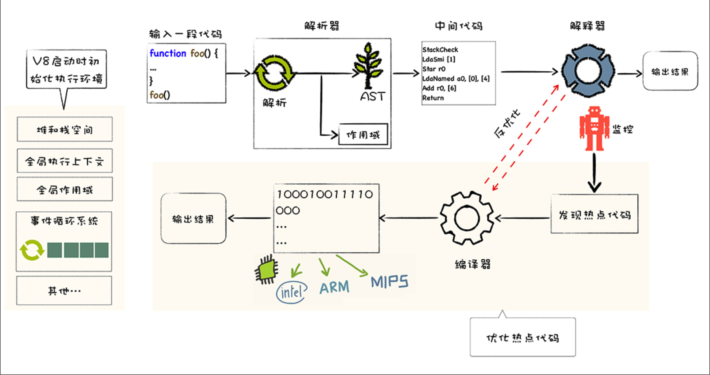
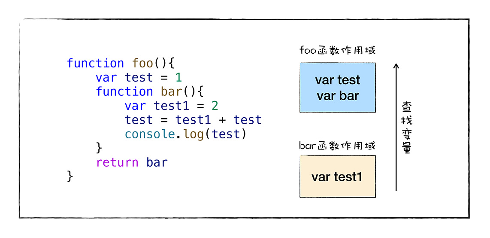
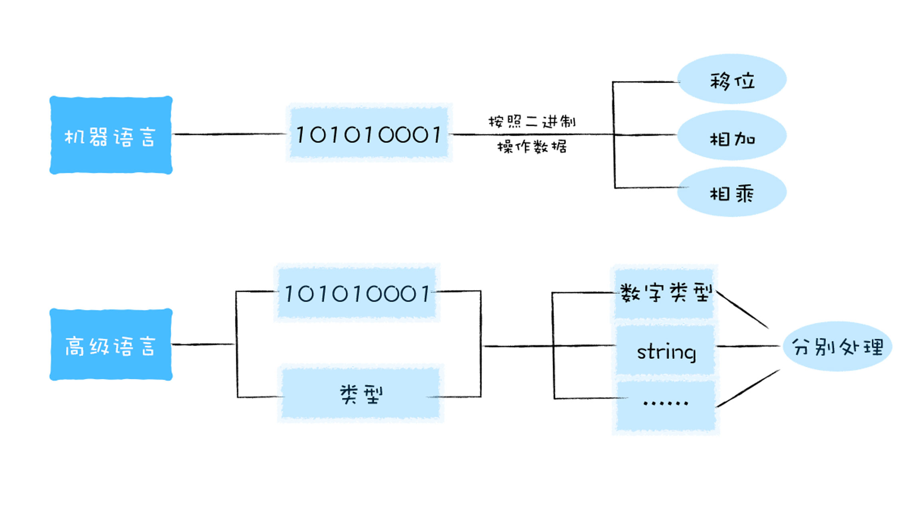

1. 什么是 V8？

   V8 是 JavaScript 引擎，是 JavaScript 核心，用来编译和执行 JavaScript 代码；也是一个虚拟器，用来模拟计算机的 CPU，堆栈，寄存器等；对于 JavaScript 来说，他就是整个世界。

2. 高级语法为什么需要编译才能被执行？

   因为执行是在 CPU 上，而 CPU 只能执行二进制指令，因此就需要有一个编译阶段，将高级语言编译成 CPU 能执行的二进制指令
   这里的二进制指令被称为指令集

   而因为二进制代码，人类非常难懂，所以就引入了汇编语言，但是同样的，汇编语言 CPU 也无法识别

通常情况下，存在 2 种编译方式，解释执行和编译执行

3. V8 如何执行 JavaScript 代码？



图中的监控机器人的作用，在解释执行代码时，作热点监控，如果发现一段代码执行次数很多，就会被编译器编译成为二进制代码，并存储这个二进制代码，如果下次再遇到这段热点代码，就会执行这段二进制代码。

### 主要流程

1. 初始化化执行环境；
2. 解析源码，生成 AST，和作用域；
3. 生成 code 码，并交给解释器执行，输出结果；
4. 在解释执行过程中，发现热点代码，编译成二进制，为后续执行优化

使用 V8 工具来解析代码连接 [https://gist.github.com/kevincennis/0cd2138c78a07412ef21]('https://gist.github.com/kevincennis/0cd2138c78a07412ef21')

### JavaScript 的函数特点

> JavaScript 是一门基于对象的语言，但是却不是一门面向对象的语言

#### 本质

函数也是一种对象，只是这个对象，可以被调用，V8 在存储一个函数的时候，会为他添加 name 属性，和 code 属性的隐藏属性，name 为函数名称，code 为函数体（即可执行的代码）。


如果某一个语言，可以把函数当做其`数据类型`处理，那么，我们就称之为`函数是一等公民`



### 函数表达式

函数表达式可以实现`代码隐藏`，还可以实现`变量隔离`

#### 函数声明和函数表达式

```js
function foo() {
  console.log("这是函数声明");
}

var bar = function () {
  console.log("这是函数表达式");
};
```

区别：函数声明，会在编译阶段就定义个 foo 是一个函数；而函数表达式是要在执行阶段，bar 被赋予一个函数

所以在作用域里显示的也不同（在 V8 `语法分析阶段`得出 AST 和作用域）


函数声明在执行前会创建执行上下文，执行上下文会存储变量作用域相关的，流程为：

1. 形参，实参相统一；
2. 遇到变量声明的，会替代原有的形参和实参
3. 函数声明，名称相同会被替代

所以：1-3 步，最后一步的权限最高，它会把前面声明的变量给替换掉，这也叫`变量提升`

### 对象继承

> 继承的本质，就是一个对象可以访问另一个对象的属性

不同语言实现继承的方式有：基于类和基于原型

JavaScript 是`基于原型实现继承`的

### 作用域链（查找变量）

每个函数都有自己的作用域，全局也有作用域（全局作用域）；作用域独立于 V8，在函数中如果内部访问外部变量，V8 就会去作用域上找。寻找变量的链路就叫做作用域链。

全局作用域是在 V8 启动过程中就创建了，且一直保存在内存中不会被销毁的，直至 V8 退出。 而函数作用域是在执行该函数时创建的，当函数执行结束之后，函数作用域就随之被销毁掉了

### 类型系统



#### V8 实现类型系统的规则

V8 会提供一个 ToPrimitve 方法，目的就是讲一个类型转换成另一个类型，流程如下：

1. 先检查该对象中是否存在 valueOf，如果其方法返回的基础类型，就使用该基础类型，如果不是基础类型；
2. 就会查看 toString 方法，使用它返回的基础类型；
3. 如果 valueOf 和 toString 都不返回基础类型，就会报 TypeError 的错误


```js
var Obj = {
  toString() {
    return "200";
  },
  valueOf() {
    return 100;
  },
};
Obj + 3;
```

## 编译流水线

### 运行时环境

运行时 V8
