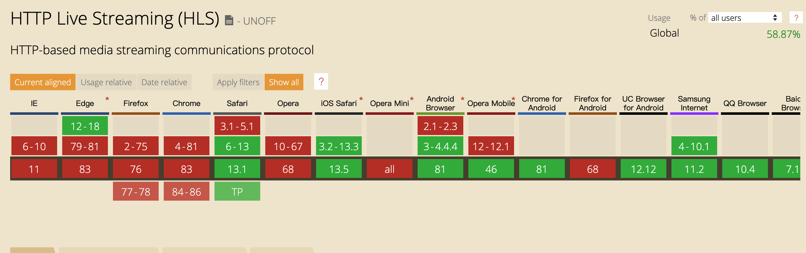

### 直播协议

1. HLS
2. RTMP
3. HTTP-FLV

#### HLS

> HTTP Live Streaming

是由苹果公司提出的基于 HTTP 的`流媒体网络传输协议`，客户端通过基于 http 请求，来一点一点下载。当直播进行时，客户端接收时，可以选择不同的源来下载播放文件。

##### 好处：

基于 http 请求的，所以能够穿透任何允许 HTTP 请求的防火墙或者代码服务器，也可以使用 CDN

##### 坏处：

延迟过大，基于 HTTP，就是基于 TCP 的。

浏览器兼容程度

### RTMP

> Real-Time Messaging protocol
