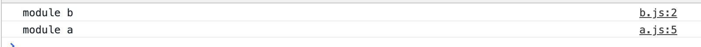
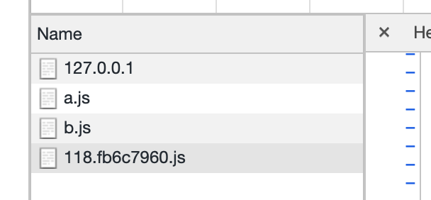

## 浏览器实现的 module

> web 访问文件，只能通过 http 协议

可以试验一下在 index.html，通过 http-server 来实现出浏览器实现的模块

```html
<!DOCTYPE html>
<html lang="en">
  <head>
    <meta charset="UTF-8" />
    <meta name="viewport" content="width=device-width, initial-scale=1.0" />
    <title>Document</title>
  </head>
  <body>
    <script src="./src/a.js" type="module"></script>
  </body>
</html>
```

其中 a.js 写入

```javascript
import b from "./b.js";
b();
console.log("module a");
```

b.js 写入

```javascript
function b() {
  console.log("module b");
}
export default b;
```

浏览器 console 和 network




浏览器会发出请求来请求这些个模块，这样就导致了，如果开发模块很多，会产生大量的请求；导致前端页面性能降低